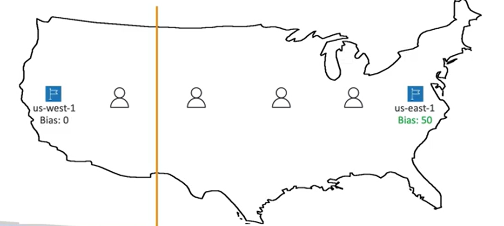

## Amazon Route53 개요

#### Amazon Route53

- A highly available,scalable,fully managed and Authoritative DNS

  - 이때 `Authoritative`란 고객이 DNS Record 업데이트할 수 있음을 의미

> Client가 example.com 도메인으로 EC2 Instance에서 실행되는 Server의 IP에 접근하고 싶은 경우 Route53에 도메인 이름 등록

- Route53은 Domain Registrar
- Resource 관련 Health 상태 확인 가능
- 100% SLA 가용성 제공하는 AWS 유일 서비스
- 53은 DNS 서비스에 사용되는 전통적인 DNS port

#### Records

- records를 사용해 특정 도메인으로 라우팅하는 방법 정의
- Record 포함사항

  - `Domain/Subdomain name`
    - e.g., example.com
  - `Record Type`
    - e.g., A or AAAA
  - `Value`
    - 매핑할 실제 server IP address
    - e.g., 123.456.789.123
  - `Routing Policy`
    - Route53이 쿼리에 응답하는 방법
  - `TTL`
    - DNS Resolver에 record가 cache되는 시간

- Route53 지원 DNS Record Type
  - `A`, `AAAA`, `CNAME`, `NS`
    - 반드시 알아야함
  - CAA, DS, MX, NAPTR, PTR, SOA, TXT, SPF, SRV
    - 고급타입 (시험X)

#### Record Types

- `A`
  - hostname과 IPv4 IP 매핑
- `AAAA`
  - hostname과 IPv6 IP 매핑
- `CNAME`
  - hostname과 다른 hostname 매핑
  - target hostname은 A 또는 AAAA record
  - CNAME은 DNS namespace의 top node에 생성할 수 없음
    - Ex. example.com에는 불가능하고, www.example.com에는 가능
- `NS`
  - Name Servers for the Hosted Zone
  - 서버의 DNS 이름 또는 IP 주소로 호스팅존에 대한 DNS 쿼리 응답
  - 트래픽이 domain으로 routing되는 방식 제어

#### Hosted Zones

- record container로, domain과 subdomain으로 가는 트래픽의 라우팅 방식 정의
- `Public Hosted Zone`
  - public domain 지원
  - 해당 domain의 IP까지 알 수 있음
  - Ex. application1.mypublicdomain.com
- `Private Hosted Zone`

  - private domain 지원
  - 가상 VPC를 사용해서 또는 특정 네트워크 내에서만 URL 접근 가능
    - private URL이기 때문에
    - private DNS record
  - Ex. application1.company.internal

- 어떤 Hosted zone이든 한 달에 $0.50 지불해야함

> Public Hosted Zone은 공개된 Client로부터 온 쿼리에 응답, 즉 example.com을 요청하면 IP 반환. Private Hosted Zone은 오직 VPC 내에서만 쿼리

## Domain 등록 및 Record 생성

#### Domain 등록

- 비용 발생
- 처음 Domain 구매 후 등록시 `NS`와 `SOA` 타입의 record 자동 생성
  - NS record는 DNS 쿼리에 응답하기 위해 AWS DNS를 사용해야 한다는 의미

#### Record 생성

- A record 생성

  - Record name: test
  - Record Type: A
  - Value: 11.22.33.44
    - 임시로 설정
    - 후에 라우팅할 실제 인스턴스 IP address로 변경 예정

- web browser에 record name과 도메인 접속
    - 접속되지 않는 것이 정상
    - value를 설정한 IP address가 없음

- A record 생성 후 확인
  - 이때 기본 명령프롬프트 사용해도 되지만 AWS CloudShell 사용 가능

```
sudo yum install -y bind-utils  #nslookup와 dig 설치
dig [RECORD NAME]   #생성한 record에 연결된 value (IP) 확인
```

    - Windows는 `nslookup` Mac은 `dig`
    - AWS CloudShell 사용시 dig 사용하면 TTL까지 나타나서 유용

## EC2&Loadbalancer 설정

> EC2 instance를 다른 region에 3개 만든 후 ALB 생성

#### EC2 생성

- Instances > Launch instances

- spec
  - Amamzon Linux
  - 64-bit
  - t2.micro
  - key pair: Proceed without a key pair 
    - EC2 instance connect 사용
  - create security group
  - allow SSH traffic from Anywhere
  - allow HTTP traffic from the internet
  - 고급 옵션
    - User data에 route53/user-data.sh 복붙
    - 해당 데이터가 브라우저에 나타남

#### Load Balancer 생성

- LoadBalancer > Create Load Balancer

- spec
  - Application Load Balancer 선택
  - Load balancer name 설정
  - IPv4
  - Networking mapping > Mappings 서브넷 3개 선택
  - 직전에 만든 Security group 선택
    - HTTP, SSH 트래픽 허용
  - Listeners and routing > Create target group
    - target group name 설정 후 Next
    - Register targets에서 직전에 만든 인스턴스 선택해 대상으로 지정
    - Include as pending below 선택 후 생성
  - target group 만들고 Listeners and routing으로 돌아와 새로고침 후 생성한 target group 선택


#### 정상 동작 확인

- Instance 동작 확인
  - Instances의 Public IPv4 address를 웹브라우저에 검색하면 user data에 입력한 sh 파일 내용 나타남
- Load Balancer 동작 확인
  - Load balancer의 DNS name을 브라우저에 입력하면 provisioning 확인 가능
  - EC2 instance 하나를 가리킴

## TTL

#### TTL

- 클라이언트가 Route53에게 URL을 물어보면, Route53은 A record와 IP 주소, TTL 전송
- 클라이언트는 TTL 기간동안 Route53으로부터 받은 결과를 캐시하고 TTL 기간이 지난 후 새로 Route53에 요청해 결과 저장
  - 클라이언트가 캐시를 저장해 해당 URL로 요청이 들어오면 바로 매핑 가능
  - Route53의 record 정보를 TTL 기간동안만 사용되고 TTL이 지난 후에 새로 정보를 받음

- High TTL 
  - Route53이 받은 트래픽 양이 적음
  - But client가 오래된 record를 받을 수 있음

- Low TTL
  - Route53이 받는 트래픽 양이 많음
  - But record 변경이 빨라지며 record 변경이 편함

#### TTL 동작 
- A 타입의 Value로 이전에 만든 instance 대입하고 TTL이 120인 record 생성
- 해당 record name을 브라우저에 검색
- record의 value를 또다른 instance로 변경한 후 즉시 record name을 브라우저에 검색
  - `dig [URL]`로 TTL과 매핑된 IP 조회
- TTL 기간이 지나기 전에는 이전에 value에 있었던 IP address로 매핑
- TTL 기간이 지난 후 변경한 IP address로 매핑
  - `dig [URL]`로 TTL과 매핑된 IP 조회

## CNAME vs Alias

> Loadbalancer나 CloudFront 등의 AWS 리소스를 사용하는 경우 AWS hostname이 노출되고, 보유한 도메인에 리소스의 호스트 이름을 매핑하고자 하는 경우 CNAME과 Alias 사용 가능

#### CNAME

- hostname으로 또다른 hostname 가리킴
  - Ex. app.mydomain.com -> blabla.anything.com
- `Root Domain이 아닌 경우에만 가능`

#### Alias
- Route53에 한정
- 호스트 이름이 특정 AWS 리소스로 향하도록 할 수 있음
  - Ex. app.mydomain.com -> blabla.amazonaws.com
- Root Domain이어도 사용 가능
- 무료
- 자체적으로 상태 확인 가능

#### Alias Record
- AWS의 리소스에만 매핑 가능
- record 생성 시 record name이 별명이 되고 Value에 AWS 리소스 DNS 넣기
  - Ex. Record name을 example.com, A 타입, Value를 loadbalancer의 DNS 주소를 넣어 record 생성
- 시중의 모든 DNS 가능
- 리소스의 IP가 바뀌어도 인식 가능
- CNAME과 달리 Alias는 Zone Apex라는 DNS namespace의 top node로 사용할 수 있음
  - Ex. example.com
- Alias의 type은 A 또는 AAAA
  - AWS의 리소스가 IPv4 또는 IPv6이기 때문
- Alias 사용할 때에는 TTL 설정할 수 없음

> Alias Records Targets는 Elastic Load Balancer, Amazon CloudFront, Amazon API Gateway, Elastic Beanstalk, S3 Websites(S3 bucket은 안 됨), VPC Interface Endpoints, Global Accelerator, Route53 record

이때 `EC2의 DNS 이름은 Alias record를 설정할 수 없음 !`

#### CNAME과 Alias 실습

- CNAME
  - record name 지정 후 record type에 CNAME, value에 loadbalancer DNS 주소 입력
  - 생성한 record name을 브라우저에 입력 
- Alias
  - record name 지정, record type에 A, Route traffic to에 Alias 선택 후 `Alias to Application and Classic Load Balancer`, `region`, `매핑하고싶은 loadbalancer DNS` 차례대로 선택
    - loadbalancer는 IPv4 트래픽만을 허용하기 때문에 A로 설정

> 이전에 등록한 domain으로 연결했을 때 해당 loadbalancer가 매핑되기를 바라는 경우

- CNAME 사용
  - `record 이름을 비우고` 위와 동일하게 진행 => <span style=" color:red">오류 발생</span>

- Alias 사용
  - `record 이름을 비우고` 위와 동일하게 진행 => 성공

## Routing Policies

#### Routing Policy 개요

- Route53이 DNS 쿼리에 응답하는 것을 도움
- Routing Policy의 "Routing"은 loadbalancer가 트래픽을 EC2 인스턴스로 라우팅하는 것과 다름
- Routing Policy의 "Routing"은 DNS 관점
  - 트래픽은 DNS를 통과하지 않고 DNS는 DNS 쿼리에만 응답하면, 클라이언트들이 HTTP 쿼리를 어떻게 처리해야 하는지 알 수 있음
  - DNS는 호스트 이름을 클라이언트가 실제 사용 가능한 endpoint로 변환하는 것을 도움
   
- Route53이 지원하는 Routing Policy
  - `Simple` / `Weighted` / `Failover` / `Latency based` / `Geolocation` / `Multi-Value Answer` / `Geoproximity` 

#### Routing Policies - Simple

- 일반적으로 트래픽을 단일 리소스로 전송하는 방식
  - Client가 Amazon Route53에 URL을 전송하면 Amazon Route53이 IP 전송
- 동일한 record에 `2 이상의 value(IP address)`가 있는 경우
  - Amazon Route53은 모든 value를 client에게 전송하고 `client가 그 중 하나를 랜덤으로 선택`해 라우팅에 적용
- Simple 라우팅 정책 + Alias
  - 하나의 AWS 리소스만을 대상으로 지정
- `상태 확인 불가능`

- 실습 
  - record 생성
    - record name: simple, record type: A, value: (이전에 만든 instance IP), TTL: 20, Routing policy: Simple routing 
  - `dig [URL]` 또는 브라우저에 record name 검색
  - record value에 또다른 instance 추가
  - `dig [URL]`을 통해 확인하면 2개의 IP가 나타나고, 브라우저에는 둘 중 랜덤으로 하나의 IP가 라우팅

#### Routing Policies - Weighted

- 가중치를 활용해 `요청의 일부 비율을 특정 리소스로 전송`하는 방식
- 각각의 record에 `상대적인 가중치` 부여
  - traffic(%)은 (특정 record의 weight)/(모든 record의 weight의 합)
  - 가중치의 합은 100일 필요 없음
- DNS `record는 같은 이름과 type`을 가져야함
- Health check와 관련있음
- 사용 케이스
  - 서로 다른 지역에 걸쳐 로드밸런싱하는 경우
  - 작은 트래픽을 전송해 테스트하는 용도
- `가중치 0인 경우` 해당 리소스에 트래픽을 전송 중단
- `모든 리소스 record 가중치의 값이 0인 경우` 모든 record가 동일한 가중치를 가짐

- 실습
  - record 생성
    - Record name: weighted, Record type: A, Value: (특정 "하나"의 IP), Routing policy: Weighted, Weight: 10, Record ID: (해당 value임을 알 수 있도록 설정), TTL: 3
    - Add another record 눌러 `Record name, type, Routing policy를 동일`하게 지정하고, `Value와 Weight, Record ID는 원하는 값으로 설정`
      - 하나의 value에 3개의 IP를 넣는것이 아니라 각각의 record를 만든 후 하나씩 넣어야함
  - Record name을 브라우저에 입력하면 가중치에 기반하여 IP가 연결됨

#### Routing Policies - Latency-based

- 지연 시간이 가장 짧은, 즉 `가장 가까운 리소스로 리다이렉팅`하는 방식
- 지연 시간에 민감한 웹사이트나 애플리케이션의 경우 유용
- 사용자의 위치와 가장 가까운 AWS region에 연결하기까지 걸리는 시간을 기반으로 지연 시간 측정

- 실습
  - record 생성
    - Record name: latency, Value: (EC2 instance 중 하나), Routing policy: Latency, Region: (Value에 넣은 IP의 region), Record ID: (해당 record임을 알 수 있도록 설정)
    - 위와 동일하게 record 3개 생성
  - record name을 브라우저에 검색하면 현재 내 위치와 가장 가까운 region의 IP address(Value)로 연결
  - `dig [URL]`을 통해 연결된 IP address 확인 가능
  - VPN 사용하여 현재 위치 변경하면 그에 맞는 IP address와 연결
    - 이떄 로컬 DNS 캐시에 있던 TTL도 초기화되어 즉시 연결
    - 이때 `dig [URL]`을 해도 변경사항은 없음 => CloudShell은 그대로 현재 위치에 존재

## Health Check

#### Health

- Health Check는 주로 공용 리소스에 대한 상태를 확인하는 방법
  - 개인 리소스의 상태 확인도 가능 => 이번 강의에서

- Health check 필요성
  - 서로 다른 두 지역에 하나씩의 loadbalancer가 있고 둘은 public loadbalancer이며 각 지역에서 application 작동 => 다중 지역 셋업 : 지역별 고가용성 추구
  - Route53을 이용해 DNS record 생성
    - latency-based로 설정
  - 만약 한 지역이 `사용할 수 없는 상태`가 되면 `사용자를 그곳으로 보내지 않아야함` => Health check로 해결
    - 각 지역의 인스턴스에 Health check 생성하며 이를 Route53의 record와 연결 가능 => `DNS 장애 조치 자동화`

- Health check
  1. monitor an endpoint
  - Ex. application, server, AWS resource
  - 특정 지역의 ALB(Loadbalancer)의 상태 확인을 위해 해당 `endpoint는 전세계로부터 15개 정도의 Health check를 받게 됨`
    - 엔드포인트의 상태를 확인하고 임계값을 정상 혹은 비정상으로 설정해 정상 판별
    - 기본적으로 30초마다 health check가 작동하지만, 10초마다도 가능
    - HTTP, HTTPS, TCP 프로토콜 지원
    - 18% 이상의 health check가 정상이라 판단하면 Route53도 정상으로 간주
    - health check를 하고싶은 위치 설정 가능
  - Health check는 loadbalancer로부터 2xx 또는 3xx status code를 받으면 통과
  - 텍스트 기반 응답의 경우 health check는 처음 5,120 bytes 확인
    - 응답 자체에 해당 텍스트가 있는지 확인하기 위해
  - Health check를 사용하기 위해서 `엔드포인트에 접근이 가능해야함`

  2. monitor other health checks
  - Calculated Health Check
  - 여러 개의 health check 결과를 하나로 합쳐주는 기능
  - Route53에 각 instance 상태 확인을 하는 Child health check가 존재하고 이를 합친 Parent health check 존재
  - Child health check를 합치기 위한 조건은 `OR,AND or NOT`
  - 256개의 child health check를 모니터링할 수 있고 child health check를 몇 번 통과해야 parent health check가 통과인지 설정할 수 있음
  - 사용케이스 : 실패하는 경우 없이 웹사이트를 관리, 유지되도록 하는 경우

  3. monitor CloudWatch Alarms :Private Hosted Zones
  - 제어가 쉽고 개인 리소스에 유용
  - 모든 Route53 health check가 공용웹에 존재하기에 VPC 외부에 존재
  - VPC 외부에 존재하기에 private endpoint에는 접근 불가능 => `CloudWatch Metric`을 만들어 `CloudWatch Alarm` 할당
  - `CloudWatch metric을 이용해 개인 subnet 내의 EC2 인스턴스(개인 리소스) 모니터링`
    - metric이 침해되면 CloudWatch Alarm 생성
  - `Alarm이 ALARM 상태가 되면 health check는 비정상`으로 간주

- CloudWatch에서 모든 health check 지표 확인 가능

#### 실습

1-1. Endpoint
- Health Check > Create Health Check
  - Step1. Configure health check
    - instance name 설정
    - Endpoint
    - IP address로 instance의 IP address 입력
    - 일반적으로 Path: /health 로 설정하지만 이번 실습에는 작성하지 않음
  - Step2. Get notified when health fails
    - 기본값인 No로 선택 
- 위 작업으로 3개의 instance 모두 health check

1-2. Endpoint health check
- 생성한 health check 중 하나를 선택해 Security groups>Inbound rules에서 HTTP type 모두 삭제
  - 일부러 장애 발생
- Health check > Health checker에서 status 확인 

2. Calculated
- Health Check > Create Health Check
  - Step1
    - instance name 설정
    - Status of other health chekcs (calculated health check) 설정
    - Health checks to monitor에 직전에 만든 3개의 health check 선택
    - Report healthy when을 통해 몇 개가 healthy 상태여야 healthy라고 간주할지 설정
      - 실습에서는 AND
  - Step2
    - 기본값 


## Routing Policies
#### Routing Policies - Failover (Active-Passive)

- `장애 조치`와 관련

>Amazon Route53, EC2 2개 존재. 하나는 기본 Primary EC2, 하나는 Secondary로 Disaster Recovery를 위한 EC2

- Primary EC2의 `기본 record와 health check를 필수적으로 연결`
- Health check가 비정상이면 Route53은 자동으로 Secondary EC2 인스턴스로 장애 조치하여 결과 전송
  - Secondary EC2도 health check 가능하지만 Primary와 Secondary 각각 한 개 씩만 가능
- `클라이언트의 DNS 요청`은 정상으로 생각되는 리소스를 자동으로 얻음
  - Primary instance가 정상이면 Route53도 기본 record로 응답
  - 비정상이면 Secondary record의 응답을 자동으로 얻게 됨

- 실습
  - record 생성
    - record name: failover, value: (instance 하나의 IP), Routing policy: Failover, TTL: 60, Failover record type: Primary로 설정, value에 맞게 Health check 지정, Record ID:(instance임을 알 수 있도록) 
    - record name: failover, value: (또다른 instance 하나의 IP), Routing policy: Failover, TTL: 60, Failover record type: Secondary로 설정, value에 맞게 Health check 지정(선택사항), Record ID:(instance임을 알 수 있도록) 

  - Primary instance에 장애 발생
    - Primary EC2 > Security groups > Inbound rules에서 HTTP type 모두 삭제
    - Health check > Health checker에서 unhealthy 확인
  - 확인
    - 이번에 생성한 record를 브라우저에 입력하면 Secondary IP로 접근
  - Primary EC2에 삭제했었던 HTTP type을 다시 추가하면 다시 복구됨

#### Routing Policies - Geolocation

- latency와는 다르게 사용자의 실제 위치를 기반으로 함
- 특정 대륙이나 국가 혹은 어떤 지역에 지정해 `가장 정확한 위치`가 선택되어 그 IP로 라우팅
- 일치하는 경우가 없는 경우 `default record 생성`
- 사용 case: 콘텐츠 분산을 제한하고 로드밸런싱을 실행하는 웹서비스 현지화
  - Ex. 영국은 영국어를 사용하는 record로, 프랑스는 프랑스어를 사용하는 record로, 그 외에는 영어를 사용하는 기본 record로 매핑되도록 함
- 해당 record는 health check와 연결할 수 있음

- 실습
  - record 생성
    - Record name: geo, value: (특정 instance), Routing policy: Geolocation, Location: (value에 설정하려는 location), Record ID: (value에 맞게 설정)
    - 원하는만큼 record 생성
    - Location이 Default인 record는 반드시 생성
  - 확인
    - record name으로 접근
    - 이후 VPN으로 위치 변경한 후 같은 record name으로 접근
      - 이때 이전에 시간초과가 발생하면 security group 확인. 실습에서는 이전에 security group의 inbound rules를 삭제해서 발생

#### Routing Policies - Geoproximity Routing Policy

- 사용자와 리소스의 지리적 위치를 기반으로 트래픽을 리소스로 라우팅
- `bias 값`을 이용해 특정 위치를 기반으로 리소스를 더 많은 트래픽을 이동하는 것
- 지리적 위치를 변경하려면 bias 값 지정
  - 특정 리소스에 많은 트래픽을 보내려면 bias를 증가시켜 확장 (1 to 99)
  - 특정 리로스에 적은 트래픽을 보내려면 bias를 음수로 축소 (-1 to -99)



- Resources can be:
  - AWS resources
    - 속한 특정 region을 지정하면 자동으로 올바른 라우팅 계산
  - Non-AWS resources (온프레미스 데이터 센터)
    - 위도와 경도를 지정해 AWS가 위치를 파악하도록 함
- bias 활용을 위해 고급 Route53 Traffic Flow 사용

#### Routing Policies - IP-based Routing

- `클라이언트 IP 주소를 기반`으로 라우팅 정의
- Route53에서 CIDR 목록(클라이언트 IP 범위) 정의하고 CIDR에 따라 트래픽을 어디로 보낼지 결정
- 사용 케이스: IP를 미리 알고 있으므로 `성능 최적화` 가능, `네트워크 비용 절감` 가능
- Ex. Route53에서 두 location을 서로 다른 CIDR block으로 정의 > location을 record에 연결 > 첫 번째 CIDR 블록을 value 1,2,3,4로 보내고, 두 번째 CIDR 블록을 5,6,7,8로 보냄
  - 이때 value는 두 개의 EC2 instance public IP
  - 사용자A가 첫 번째 location에 속하는 IP 주소로 들어오면 1,2,3,4로 리디렉션
  - 사용자B가 두 번째 location에 속하는 IP 주소로 들어오면 5,6,7,8로 리디렉션되어 IP 5,6,7,8 인스턴스에 대한 DNS 쿼리를 받음

#### Routing Policies - Multi-Value

- `트래픽을 다중 리소스로 라우팅`할 때 사용해 Route53은 다중 value와 resource 리턴
- health check와 연결이 가능하고 healthy resource의 value만 리턴
- 최대 8개의 healthy record 리턴
- ELB와 유사해보이지만 ELB를 대체할 수 없음
  - 클라이언트 측면의 loadbalancing
- `Simple Routing Policy`는 health check를 할 수 없기에 랜덤으로 선택한 `record가 unhealthy할 수 있음`
  - 이것이 `Multi-Value가 조금 더 강력한 record 유형`인 이유 

- 실습
  - record 생성
     - Record name: multi, Value:(원하는 IP), Routing policy: Multivalue answer, health check:(IP에 맞게), Record ID: (IP임을 알 수 있도록), TTL: 60
     - 아래에 원하는만큼의 record 생성
  - 확인
    - CloudShell에서 `dig [RECORD NAME]` 하면 `healthy한 IP만이 출력`되고 `healthy한 IP만이 매핑됨`


