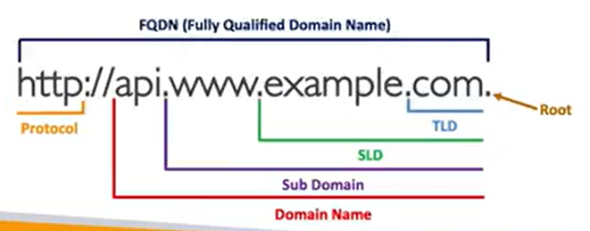
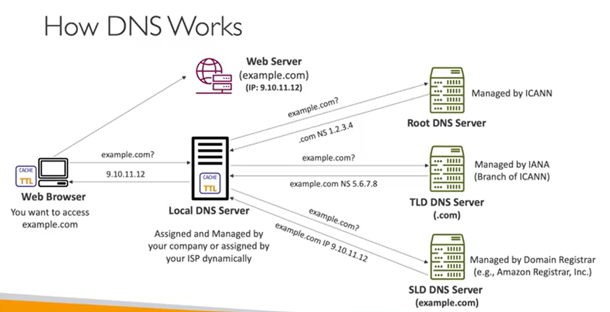

## What is DNS

#### DNS (Domain Name System)

- 사람에게 친숙한 hostname(URL)을 대상 server IP address로 변환

Ex. www.google.com -> 172.217.18.36

- Hierarchical naming structure

  - `.com` , `example.com`, `www.example.com`, `api.example.com`

- Terminology

  - `Domain Registrar`
    - domain 이름을 등록하는 곳
    - Ex. Amazon Route53, GoDaddy
  - `DNS Records`
    - A, AAAA, CNAME, NS
  - `Zone File`
    - 모든 DNS record 포함
    - 호스트 이름과 IP(또는 주소) 일치시키는 방법
  - `Name Server`
    - DNS 쿼리를 실제로 해결하는 서버
  - `FQDN` (Fully Qualified Domain Name)
    - 전체 주소 도메인 이름의 약자
    - TLD와 SLD, Sub Domain을 포함한 "Domain Name과 Protocol" 전체
  - `Top Level Domain(TLD)`
    - .com , .us, .in, .gov, .org
  - `Second Level Domain(SLD)`
    - amazon.com , google.com
    - 단어 사이에 . 존재

#### DNS 동작원리

> Web Server에 example.com 도메인 이름으로 접근하는 경우 가정

1. `Web Browser` > `Local DNS Server`

- Web Brower: "example.com 아시나요?"
- Local DNS Server: 해당 쿼리를 본 적 있는 경우 cache가 존재해 Web Browser에게 바로 IP address 전달
- 없는 경우 DNS Server에 요청 (아래 과정)

2. `Local DNS Server` > `Root DNS Server`

- Local DNS Server: "example.com 아시나요?"
- Root DNS Server: "모르지만, .com은 알고 있어요"
  - .com은 NS(NameServer) record로, NameServer의 공인 IP인 1.2.3.4 전달
  - 정답은 정확히 몰라도 그에 가까운 IP 주소 전달

3. `Local DNS Server` > `TLD DNS Server`

- 이때 TLD DNS Server는 `.com`
- Local DNS Server: "example.com 아시나요?"
- TLD DNS Server: 정확히 어떤 record인지 모르지만, example.com이라는 서버는 알고 있어 NS 5.6.7.8 전달

4. `Local DNS Server` > `SLD DNS Server`

- 이때 SLD DNS Server는 `example.com`
    - 서브 도메인의 DNS Server
    - Domain name registrar에 의해 관리되는 서버로, Amazon Route 53
- Local DNS Server: "example.com 아시나요?"
- SLD DNS Server: example.com에 대한 항목이 존재하고 이는 A record이며 IP는 9.10.11.12

5. `Local DNS Server` > `Web Browser`

- Local DNS Server: 정확한 답변을 얻었으므로 cache로 저장해 다음 Web Browser가 example.com을 찾을 때 즉시 답변 가능 
- Web Browser: 원하는 IP 얻음

6. `Web Browser` > `Web Server`

- 해당 IP 주소로 Web Server에 접근

