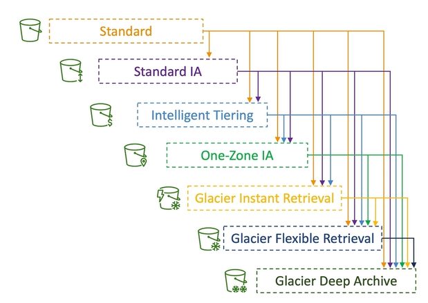

## S3 수명 주기 규칙

#### Moving between Storage Classes

- 다른 storage class 간에 객체를 옮기는 방법
  

- object에 자주 액세스하지 않을 것을 알고 있다면 `Standard IA`
- object를 아카이브화하려는 것을 알고 있다면 `Glacier tier 또는 Deep Archive tier`

- object를 수작업으로 옮길 수도 있지만 `Lifecycle Rules`를 이용해 자동으로 옮길 수도 있음

##### Lifecycle Rules

- `Transition Actions`: 다른 storage class로 이전하기 위해 object 설정

  - 생성된지 60일 후에 Standard class로 이전
  - 6개월 후에 Glacier로 이전해 아카이브화

- `Expiration actions`: 일정 시간 후 만료되어 object 삭제하도록 설정

  - access log file은 365일 후 삭제
  - versioning을 활성화했다면 해당 rule을 이용해 오래된 버전 삭제 가능
  - 불완전한 multi-part upload 삭제 가능

- Rule을 특정한 접두어에 대해 지정 가능

  - bucket 전체에 적용하거나 bucket 내의 특정한 경로에 적용
  - ex. s3://mybucket/mp3/\*

- Rule을 특정한 object tag에 대해 지정 가능
  - ex. Department: Finance

#### Lifecycle Rules (Scenario 1)

> 프로필 사진로 썸네일을 생성해 Amazon S3에 업로드하는 EC2 application 존재. 썸네일은 쉽게 재생성될 수 있고 60일동안만 보관. 원본 이미지는 60일동안 즉시 받을 수 있어야하며 그 후로는 최대 6시간 기다릴 수 있음. 이러한 규칙을 설계하는 방법은?

- S3 원본 이미지는 Standard class에 있을 수 있고, 60일 후에 Glacier로 이전하기 위한 lifecycle 설정 존재
- 썸네일 이미지는 빈번히 액세스하는 것이 아니고 쉽게 재생성할 수 있기에 One-Zone IA에 있을 수 있고, 60일 후에 그것들을 만료시키거나 삭제하는 lifecycle 설정 존재
- 이때 썸네일과 원본 이미지는 접두어를 통해 구분

#### Lifecycle Rules (Scenario 2)

> 회사 규칙에 따라 30일동안 삭제된 S3 객체를 즉각적으로 복구할 수 있어야 함. 드물게 그 기간이 지나면 최장 365일동안은 삭제된 객체를 48시간 이내에 복구할 수 있어야 함.

- `S3 versioning을 활성화`해 객체 버전을 보관할 수 있고 삭제된 객체들은 실제로 삭제 마커에 의해 감춰져 있어 복구할 수 있음
- 현재 버전이 아닌, 즉 최상위 버전이 아닌 객체를 Standard IA로 이전하기 위한 규칙 생성
  - 이때 구버전은 아카이브화를 목적으로 Glacier Deep Archive로 이전

#### Amazon S3 Analytics - Storage Class Analysis

> 어떻게 객체를 다른 클래스로 이전할 최적의 일수를 결정하는가

- `Amazon S3 Analytics` 이용
- `Standard나 Standard IA 추천`
  - One-Zone IA와 Glacier와는 호환되지 않음
- S3 bucket에 S3 Analytics가 실행되면 .csv 보고서를 생성하고 약간의 추천사항과 통계 제공
- Report가 매일 업데이트되며 분석 결과가 보일 때까지 24시간에서 48시간이 소요
- 이러한 보고서는 합리적인 Lifecycle Rules를 조합하거나 개선하기 위해 좋음

## S3 요청자 지불

#### Requester Pays

- 일반적으로 bucket 소유자가 bucket과 관련된 모든 Amazon S3 storage 및 데이터 전송 비용 지불

  - bucket set이 있고 bucket내에 object 존재해 bucket 소유자가 비용 지불
  - 요청자가 bucket으로부터 파일 다운로드할 때 발생하는 네트워크 비용까지 bucket 및 object 소유자에게 청구

- `Requester Pays buckets` 활성화

  - bucket 소유자가 아닌 요청자가 객체 데이터 다운로드 비용 지불하는 방식
  - bucket과 object 소유자가 storage 비용 지불
  - 요청자가 객체를 다운로드하면 그 요청자가 다운로드와 관련된 네트워킹 비용 지불

- 대량의 데이터 셋을 다른 계정과 공유할 때 유용
- 요청자가 익명이어서는 안 됨
  - AWS가 객체에 대한 특정 다운로드를 요청한 요청자에게 청구할 수 있도록 요청자가 AWS에서 인증을 받은 사람이어야함

## S3 이벤트 알림

#### Event Notifications

- Event: S3에 객체 생성, 객체 삭제, 객체 복구, 객체 복제
- Event filtering: ex. \*.jpg 객체만 고려하고 싶음
- Use case

  - Amazon S3에서 일어나는 특정한 이벤트에 자동으로 반응하려는 경우
    - Ex. 업로드된 모든 이미지의 썸네일을 생성하는 경우, 이벤트 알림을 만들고 몇몇 대상(SNS, SQS, Lambda function)에게 전송

- S3 event는 원하는만큼, 원하는 타켓에 전송할 수 있음

#### S3 Event Notifications - IAM Permissions

- Event notification을 작동하려면 IAM 권한이 있어야 함

- 하지만 Amazon S3의 IAM 역할을 사용하지 않고 별도의 resource access policy 정의로 event notification 가능
- Ex1. S3 service가 데이터를 SNS Topic에 전송
  - SNS resource policy 필요
    - SNS resource policy는 SNS topic에 첨부하는 IAM policy
    - S3가 SNS에 직접 메세지를 전송할 수 있도록 허용
- Ex2. S3 service가 데이터를 SQS Queue에 전송

  - SQS resource policy 필요
    - SQS resource policy는 S3가 SQS Queue에 데이터 전송할 수 있도록 허용

- Ex3. S3 service가 데이터를 Lambda Function에 전송
  - Lambda resource policy 필요
    - S3가 함수를 호출할 권한 제공

#### S3 Event Notifications - with Amazon EventBridge

- event는 S3 bucket으로 가고 모든 event는 결국 Amazon EventBridge로 감
- EventBridge에서 rule을 설정할 수 있음
  - rule 덕분에 event는 18가지 AWS service에 전송할 수 있음
  - => S3 event notification 능력 크게 향상
- EventBridge
  - Advanced filtering: 훨씬 많은 고급 필터링 옵션 사용 가능 (metadata, object size, name)
  - Multiple Destination: 한 번에 많은 대상에 전송할 수 있음 (Step Functions, Kinesis Streams, Firehose)
  - EventBridge Capabilities: Archive, Replay Events, Reliable delivery

> 요약하면 Amazon S3에서 일어나는 event를 SNS, SQS, Lambda 혹은 Amazon EventBridge에 전송해 event에 반응할 수 있도록 함

## S3 퍼포먼스

#### Baseline Performance

- 기본적으로 S3는 요청이 아주 많을 때 자동으로 확장
- S3는 bucket 내에서 `접두사당` `초당` 3500개의 PUT/COPY/POST/DELETE, `초당` 5500개의 GET/HEAD 요청 지원
  - 고성능을 의미
- Bucket 내에 접두사 수의 제한은 없음
- Example (prefix 별로 object path)
  - `bucket/folder1/sub1/file`
    - /folder1/sub1/이 접두사(prefix)
  - `bucket/folder1/sub2/file`
    - /folder1/sub2/가 접두사
  - `bucket/1/file`
    - /1/이 접두사
  - `bucket/2/file`
    - /2/가 접두사
- 위와 같이 4개의 접두사에 읽기 요청을 균등하게 분산하면 초당 22000개의 GET/HEAD 요청을 처리할 수 있음

#### S3 Performance

- `Multi-Part upload`

  - 100MB가 넘는 파일은 multi-part upload를 사용하는 것이 좋음
  - 5GB가 넘는 파일은 반드시 사용해야함
  - 업로드를 병렬화하므로 전송 속도를 높여 대역폭을 최대화할 수 있음

- `S3 Transfer Acceleration`
  - 업로드와 다운로드를 위한 S3 `전송 가속화`
  - 파일을 AWS edge 위치로 전송해 전송 속도를 높이고 데이터를 대상 region에 있는 S3 bucket에 전달
  - edge location은 region보다 수가 많음
  - multi-part upload와 같이 사용할 수 있음

> USA에 있는 파일을 Australia region의 bucket에 전송할 때, USA의 file을 Public internet을 사용해 USA의 Edge Location에 전송. Edge Location에서 Australia bucket까지 private internet을 사용해 전송

- Public Internet의 사용량을 최소화하고 Private AWS network의 사용량을 최대화

#### S3 Performance - S3 Byte-Range Fetches

- `S3 Byte-Range Fetches`: 파일을 수신하고 읽는 가장 효율적인 방법
- 파일에서 특정 바이트 범위를 가져와 GET 요청을 병렬화
  - 다운로드 속도 높임
- 특정 바이트 범위를 가져오는데 실패한 경우에도 더 작은 바이트 범위에서 재시도하므로 복원력이 높음
- Use case
  - 다운로드 속도를 높일 때
  - 파일의 일부만 검색할 때

## S3 셀렉트 & Glacier Select

#### S3 Select & Glacier Select

- S3에서 파일을 검색할 때 검색한 다음 필터링하면 너무 많은 데이터를 검색하게 됨
- 서버 측 필터링을 하여 SQL 사용해 더 적은 데이터 회수
- SQL문에서 간단히 행과 열을 사용해 필터링 가능
- 네트워크 전송이 줄기 때문에 데이터 검색과 필터링에 드는 클라이언트 측의 SPU 비용 감소

- Before

  - 모든 데이터 검색 후 application 측에서 필터링을 통해 필요한 것 찾음
    - 많은 데이터 가져와서 조금의 데이터만 사용

- After S3 Select

  - Amazon S3가 대신 파일 필터링해주고 필요한 데이터만 검색
  - 속도가 400% 빨라지고 비용은 80% 줄어듬

- Ex

  - Amazon S3 Select로 CSV 파일 가져옴
  - Amazon S3는 이 CSV 파일 찾아서 자체 서비스인 서버 측에서 필터링해 우리에게 필터링된 데이터 세트를 보냄
  - 데이터의 크기가 훨씬 작아 저렴해짐

- 간단한 필터링에 S3 Select 또는 Glacier Select 추천

## S3 Batch Operations

#### S3 Batch Operations

- 단일 요청으로 기존 S3 객체에서 대량 작업을 수행하는 서비스
  - 한 번에 많은 S3 객체의 metadata와 property를 수정할 수 있음
  - S3 bucket 간의 객체를 복사할 수 있음
  - S3 bucket 내 암호화되지 않은 `모든 객체를 암호화`할 수 있음
  - ACL이나 Tag 수정
  - S3 Glacier에서 한 번에 많은 객체 복원 가능
  - Lambda 함수를 호출해 S3 Batch Operations의 모든 객체에서 사용자 지정 작업을 수행할 수도 있음
- 작업은 list of objects, the action to perform, optional parameter로 구성
- 직접 스크립팅하지 않고 S3 Batch Operations 사용 이유
  - 재시도를 관리할 수 있음
  - 진행상황을 추적하고 작업 완료 알림을 보내고 보고서 생성을 할 수 있음

- S3 Batch에 전달할 객체 목록 생성 방법
  - `S3 Inventory` 기능을 사용해 객체 목록 가져옴
  - `S3 Select`를 사용해 객체 필터링
- 객체 목록 생성 후 S3 Batch Operations 전달
  - 수행할 작업, 매개변수와 함께 객체 목록을 전달
- S3 Batch Operations가 작업을 수행하고 객체 처리

- Use case
  - S3 Inventory를 사용해 암호화되지 않은 모든 객체를 찾고, S3 Batch Operations를 사용해 한 번에 모두 암호화