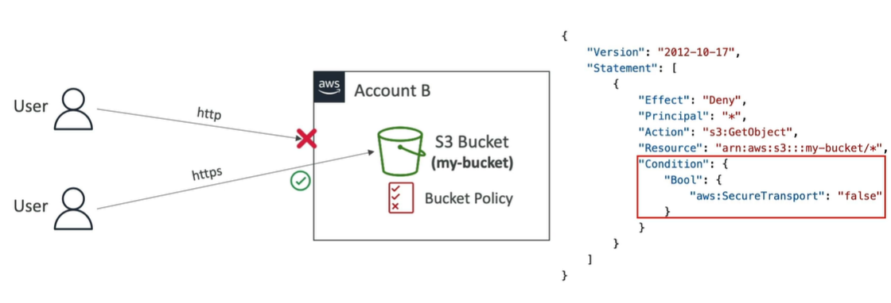
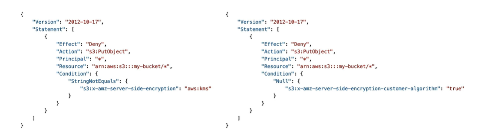

## S3 암호화

#### Amazon S3 - Object Encryption

- Bucket 내 Object 암호화하는 방법
  - 1. Server-Side Encryption (SSE)
    - `Server-Side Encryption with Amazon S3-Managed Keys (SSE-S3)`
      - Amazon S3에서 관리하는 key를 이용한 server 측 암호화
      - bucket과 object에 대한 기본 암호화 방식
    - `Server-Side Encryption with KMS Keys stored in AWS KMS (SSE-KMS)`
      - KMS key를 이용해 암호화 key 관리
    - `Server-Side Encryption with Customer-Provided Keys (SSE-C)`
      - 고객(사용자)가 제공하는 key 사용
  - 2. Client-Side Encryption
    - 클라이언트 측의 모든 것을 암호화한 다음에 Amazon S3에 업로드

#### Amazon S3 Encryption - SSE-S3

- AWS가 처리하고 관리하고 소유한 key를 이용해 암호화
- 사용자는 그 key에 access 할 수 없음
- object는 AWS에 의해 서버 측에서 암호화
- 암호화 보안 유형은 AES-256
- SSE-S3 메커니즘을 이용해 객체를 암호화하도록 요청하기 위해 `헤더를 "x-amz-server-side-encryption":"AES256"`으로 설정
- 새로운 bucket과 새로운 object에 대해 기본값으로 활성화

> 사용자는 올바른 헤더를 써서 파일 업로드. 해당 파일은 Amazon S3 bucket의 object가 됨. Amazon S3는 S3가 보유한 key와 그 object를 매핑. 이후 key와 object는 혼합해 암호화되고 그 것이 S3 bucket에 저장

#### Amazon S3 Encryption - SSE-KMS

- KMS 서비스, 즉 key 관리 서비스를 이용해 직접 자신의 key 관리
- 반드시 `헤더가 "x-amz-server-side-encryption":"aws:kms"`로 설정되어야 함

- 장점
  - 사용자가 key를 직접 통제할 수 있다는 장점이 있음
    - 직접 생성할 수도 있음
  - CloudTrail을 이용해 key 사용 검사할 수 있음
    - 누군가가 KMS에서 key를 사용할 때마다 Logging 서비스인 CloudTrail에 로깅될 것

> 올바른 헤더를 가지는 객체 업로드. 해더 안에 우리가 사용하려는 KMS key 지정. 그러면 object가 Amazon S3에 나타나고 이번에 사용될 KMS key가 AWS KMS 외부에서 오게 됨. 이후 key와 object가 혼합해 암호화가 이루어지고 그 파일이 S3 bucket으로 전달

- 따라서 객체에 접근할 수 있을뿐만 아니라 객체를 암호화하는데 사용된 KMS key에도 액세스할 수 있어야 함

- 제한 사항
  - bucket의 처리량이 많고 모든 것이 KMS key로 암호화되어있으면 `throttling` 발생할 수 있음
    - Amazon S3로 업로드하고 다운로드하기 때문에 KMS key 사용해야함
    - KMS key에는 GenerateDataKey 같은 자체 API가 있음
    - 다운로드 시 Decrypt API를 사용해 복호화
    - KMS 서비스에 API 호출하고 그 API 호출 건은 모두 KMS 초당 API 호출 쿼터에 합산
    - 서비스 쿼터 콘솔을 이용해 쿼터를 늘릴 수 있지만, region에 따라 초당 5000 내지 30000 건의 요청 가능

#### Amazon S3 Encryption - SSE-C

- key가 AWS 외부에서 관리되지만 여전히 서버 측 암호화
  - 우리가 그 key를 AWS로 전송하기 때문
- 하지만 Amazon S3는 `우리가 제공한 암호화 키를 절대 저장하지 않음`
  - 사용 후 폐기
- key를 S3로 전송하기 때문에 반드시 `HTTPS` 사용해야 함
- 모든 요청에 HTTP 헤더의 일부로서 key 전달해야함

> 사용자가 파일과 key 업로드. 이때 key는 사용자가 AWS 외부에서 관리. Amazon S3는 클라이언트가 제공한 Key과 object를 사용해 약간의 암호화 수행. 암호화된 파일을 S3 bucket에 저장. 사용자가 파일을 읽으려면 파일을 암호화하기 위해 사용한 key를 제공해야함

#### Amazon S3 Encryption - Client-Side Encryption

- Amazon S3 Client-Side Encryption Library와 같은 클라이언트 라이브러리 사용하면 더 쉽게 구현 가능
- 클라이언트가 직접 데이터를 암호화한 다음 Amazon S3에 전송
- Amazon S3로부터 데이터를 받을 수 있고 데이터의 복호화는 Amazon S3 외부 클라이언트 측에서 이루어짐
  - 이때문에 클라이언트가 key와 암호화 사이클을 완전하게 관리하게 됨

> 업로드할 파일과 AWS 외부에 클라이언트 key 존재. 클라이언트가 직접 암호화 진행해 암호화된 파일 생성. 업로드하기 위해 해당 파일 bucket에 HTTP(S)로 전송해 업로드

#### Amazon S3 - Encryption in transit (SSL/TLS)

- 전송 중 암호화 또는 통신 중 암호화는 SSL 또는 TLS라 불림
- Amazon S3 bucket에는 기본적으로 2개의 endpoint 존재
- 암호화가 되지 않는 HTTP 엔드포인트와 전송 중 암호화가 제공되는 HTTPS 엔드포인트
  - 사용자와 타킷 서버 간의 연결이 보안 연결인지, 완전히 암호화되어있는지 확인 가능
- S3를 사용할 때에는 데이터 송신 보안을 위해 HTTPS를 사용하도록 권장
- 특히 SSE-C 메커니즘을 사용할 때에는 반드시 HTTPS 프로토콜 사용해야 함
- 모든 클라이언트가 기본값으로 HTTPS를 사용하기에 걱정할 필요X

#### Amazon S3 - Force Encryption in Transit "aws: SecureTransport"

- 전송 중 암호화를 강제하는 방법

- S3 bucket에 bucket policy를 첨부하고 JSON 형태 첨부

  - 이때 aws:SecureTransport가 false라면 GetObject 작업을 거부하라고 하는 것
  - HTTP를 사용할 경우 언제나 SecureTransport는 true
  - 암호화 연결을 사용하고 있지 않다면 false
  - SecureTransport가 false이면 HTTP 통신으로는 접근할 수 없고 HTTPS로만 접근할 수 있음

  

## DSSE-KMS에 대한 안내

- DSSE-KMS는 KMS를 기반으로 한 이중 암호화

## S3 기본 암호화

#### Default Encryption vs Bucket Policies

- Default로 모든 bucket은 SSE-S3 암호화되어있음
  - 즉, bucket에 저장된 새로운 객체에 SSE-S3 암호화가 자동으로 적용
  - 다른 암호화 방식으로 변경할 수 있음
- Bucket policy를 이용해 `암호화를 강제`하고 올바른 암호화 헤더가 없는 경우 S3 객체를 PUT하는 API 호출을 거절할 수 있음

  - SSE-KMS, SSE-C 거부할 수 있음
    

- Bucket Policy는 기본적으로 암호화 설정 전에 이루어짐

## S3 CORS

#### What is CORS?

- Cross-Origin Resource Sharing (CORS)
- Origin = scheme(protocol) + host(domain) + port

  - Ex. https://www.example.com은 HTTPS port 443, protocol은 HTTPS, domain은 www.example.com

- CORS는 웹 브라우저 기반 보안 메커니즘으로, main origin을 방문하는 동안 다른 origin에 대한 요청을 허용하거나 거부

  - Same Origins: `http://example.com/app1`, `http://example.com/app2`
  - Different Origins: `http://www.example.com`, `http://other.example.com`
  - 웹 브라우저가 한 웹사이트를 방문하는 동안 다른 웹사이트에 요청을 보내야할 때 다른 origin이 `CORS Header`를 사용해서 요청하지 않는 한 해당 요청은 이행되지 않음

- 작동 방식
  - Origin Web Server (https://www.example.com), Web Browser, Cross-Origin Web Server (https://www.other.com) 존재
  - 웹브라우저가 `origin web server에 HTTPS 요청`
  - 결과의 일부로 검색된 index.html 파일이 다른 웹서버에서의 이미지를 가져와야함
  - 웹브라우저는 보안 기능이 내장되어있어 `cross-origin web server에 사전 요청` 전송
    - www.other.com에 대한 옵션이 필요하고 해당 요청이 https://www.example.com
  - 웹서버가 CORS를 사용하도록 구성되었다면, 웹브라우저에 example.com origin을 허용하고, GET,PUT,DELETE 메서드 허용하는 `CORS Header 전송`
  - 웹브라우저가 이 CORS Header에 만족하면 `웹 브라우저는 다른 서버에 이 파일을 검색하고 호출하도록 요청`

#### CORS

- Amazon S3에 적용
- 클라이언트가 S3 bucket에서 CORS를 요청하면 정확한 CORS Header를 활성화해야함
- 해당 작업을 빠르게 수행하려면 특정 origin을 허용하거나 \*를 붙여 모든 origin 허용

- 작동 방식

  - 웹브라우저와 정적 웹사이트가 활성화된 S3 bucket(my-bucket-html), 또다른 정적 웹사이트가 활성화된 S3 bucket(my-bucket-assets) 존재
  - 1. 웹브라우저는 첫 번째 S3 bucket으로 가서 해당 URL에 대한 index.html 파일 요청
    - 정적 웹사이트 URL
  - 2. 이미지가 들어있는 index.html 반환
    - 이때 이미지는 다른 웹사이트에 존재
  - 3. 웹브라우저가 두 번째 S3 bucket에 해당 파일 요청
  - 4-1. S3 bucket이 정확한 CORS header를 갖도록 구성되지 않았다면 요청 거부
  - 4-2. S3 bucket이 정확한 CORS header를 가진다면 이미지 반환

- 즉 CORS는 웹브라우저 보안 메커니즘으로, 다른 origin에서 한 S3 bucket에 들어있는 image, asset, file을 요청할 수 있게 해줌

## S3 MFA Delete

#### MFA Delete

- MFA는 Multi-Factor Authentication으로, 사용자가 장치에서 코드를 생성하도록 강제
  - Google Authenticator 애플리케이션이 설치된 휴대폰이나 MFA 하드웨어 장치

- MFA는 코드를 생성하는데 중요한 작업을 수행하기 전에 Amazon S3에 해당 코드 삽입해야 함

- 필요한 경우
    - `객체 버전을 영구적으로 삭제`할 때 영구 삭제에 대한 보호 설정으로 사용
    - bucket에서 versioning을 중단할 때에도 필요
- 필요하지 않은 경우
    - Versioning을 활성화하거나 삭제된 버전을 나열하는 작업에서는 필요하지 않음
- MFA Delete를 사용하려면 먼저 bucket에서 versioning을 활성화해야함
- Bucket 소유자, 즉 Root account만이 MFA Delete를 활성화하거나 비활성화할 수 있음

## S3 액세스 로그

## S3 사전 서명된 URL

## S3 잠금 정책 및 Glacier 볼트 잠금

## S3 액세스 포인트

## S3 오브젝트 람다
